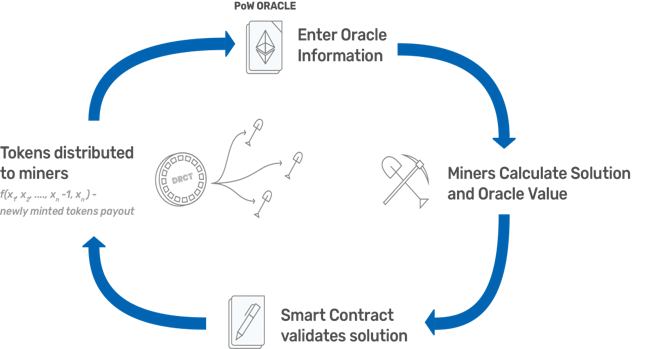

<p align="center">
  <a href='https://www.tellor.io/'>
    
  </a>
</p>

<p align="center">
  <a href='https://dapp.daxia.us/'>
    
  </a>
  <a href='https://deriveth.slack.com/'>
    
  </a>
  <a href='https://t.me/daxiachat'>
    
  </a>
  <a href='https://twitter.com/DaxiaOfficial'>
    
  </a> 
   
</p>

    
## Table of Contents
   * [Overview](#overview)
   * [Implementation](#implementation)
     * [Incentives](#incentives)
     * [Mining](#mining)
     * [Security](#security)
   * [Potential Applications](#potential-applications)
   * [Conclusion](#Conclusion)
   * [Updates](#Updates)

<details><summary>Contributing information</summary>

   * [Maintainers](#Maintainers)
   * [How to Contribute](#how2contribute)
   * [Copyright](#copyright)
 </details>

### Overview <a name="overview"> </a>
Ethereum smart contracts cannot access off-chain data. If your smart contract relies on off-chain (e.g. internet) data to evaluate or execute a function, you either have to manually feed the data to your contract, incentivize users to do it, or rely on a centralized party to provide the data (Oraclize.it is generally the standard).

The tellor oracle is a decentralized oracle. It provides a decentralized alternative for contracts to interact with and obtain data from off-chain (aka API data).

Tellor implements a hybrid Proof-of-work (PoW)/Proof-of-Stake (PoS) model where miners have to stake tellor tributes (tellor's native token) to be able to mine and along with the PoW solution they also provide an off-chain data point. The first five miners to provide the PoW and off-chain data point are rewarded: the miner with the median value is given the highest reward since that is what is used as the 'offical' value and the four miners get a lower reward that decreases the further they are from the median. Once validated and processed the value is available for on-chain contracts to use. The value can be disputed by anyone holding tellor tributes within 10 blocks after being mined for a fee. After the value goes to dispute, anyone holding tributes can vote on it's validity. If the vote determines the value was invalid the reporting party gets awarded the miner's stake, otherwise the wrongly acused miner gets the reporting fee.

<p align="center">

</p>

### Implementation <a name="Implementation"> </a>

Tellor provides an effective, secure system for off-chain data that requires inputs from five random parties(miners) and disincentives dispersion and adversarial submissions through the payout structure and a proof of work challenge that is chosen at random for each submission. 

Miners are required to stake tributes before they are allowed to mine. Once the miner is staked, the stake gets locked for the minimum stake period(one week) and if any dispute is raised against them during that period the stake gets locked until the dispute vote timeperiod expires. 


### Incentives <a name="incentives"> </a>
Miners are given two types of rewards, 1)a base reward per every successful submission, 2)request rewards/tips every time a users request a value. 


#### Mining base reward
Similar to the way Ethereum rewards ‘Uncles’ or miners who were close to winning, the first five miners to submit a PoW and off-chain value are awarded tributes. The miner that submits the median value is awarded a larger quantity of the total payoff. The current incentive structure leverages game-theory to disincentivize dispersion and adversarial submissions. The payout structure is specified when deploying a new oracle. 

Tellor Base Reward Mechanism  

<p align="center">

</p>

As miners submit the PoW, API Id, and off-chain value, the value is sorted and as soon as five values are received, the median value (integer) and the timestamp (Unix timestamp) are saved to create an on-chain timeseries and a new challenge is assigned. The median value is selected efficiently via an insert sort in the pushValue function used within the OracleToken contract proofOfWork function:

```solidity
    function pushValue(uint _apiId, uint _time, uint _payoutMultiplier) internal {
        Details[5] memory a = first_five;
        uint[5] memory _payout;
        uint i;
        for (i = 1;i <5;i++){
            uint temp = a[i].value;
            address temp2 = a[i].miner;
            uint j = i;
            while(j > 0 && temp < a[j-1].value){
                a[j].value = a[j-1].value;
                a[j].miner = a[j-1].miner;   
                j--;
            }
            if(j<i){
                a[j].value = temp;
                a[j].miner= temp2;
            }
        }
        for (i = 0;i <5;i++){
            _payout[i] = payoutStructure[i]*_payoutMultiplier;
        }
        batchTransfer([a[0].miner,a[1].miner,a[2].miner,a[3].miner,a[4].miner], _payout,true);
        devTransfer(address(this),(payoutTotal * devShare / 100));
        values[_apiId][_time] = a[2].value;
        minersbyvalue[_apiId][_time] = [a[0].miner,a[1].miner,a[2].miner,a[3].miner,a[4].miner];
        emit Mine(msg.sender,[a[0].miner,a[1].miner,a[2].miner,a[3].miner,a[4].miner], _payout);
        emit NewValue(_apiId,timeOfLastProof,a[2].value);
    }
```

Miners are rewarded with tributes. Trubutes are charged for API requests. This gives each token value, and more importantly, the value goes up as more smart contracts use our Oracle, thus creating a stronger incentive for miners to continue to mine and provide correct values.


#### Mining rewards and tips

Users can incentivize miners by posting a bounty via the addToValuePool function to ensure the timestamp they are interested on is mined. This function basically allows users to tip the miners.


#### Mining <a name="mining-process"> </a>
One of the main challenges for a mineable token or any process that relies on mining is that there are many ASICS currently available and if used on a small ecosystem these specialized systems can quickly monopolize it. Daxia's proof of work challenge is designed to be different that Bitcoin mining challenge. The challenge is chosen at random from three possible options for each submission. This setup requires miners to invest significant amount of time to update the mining algorithm and should disincentivize miners to become part of the ecosystem too early, allowing it to grow and mature before larger players join. 

The PoW, is basically guessing a nonce that produces a hash with a certain number of leading zeros using the randomly selected hash function. The PoW challenge is chosen at random from the three challenges included in the proofOfWork function and the difficulty for the PoW is adjusted to target 10 minutes. However, the difficulty only increases if the previous challenge is solved faster than 60% of the timetarget. If it was a hard cutoff, it ran a higher risk of the next value failing submission if it takes longer than the time target to mine or be added to the Ethereum mainnet.   Miners can submit the PoW and the off-chain value using the function proofOfwork in OracleToken.sol. 

The mining process is formally expressed as:

```solidity
    function proofOfWork(string calldata nonce, uint _apiId, uint value) external returns (uint256,uint256) {
        require(getStakeAmt(msg.sender)>0);
        bytes32 _solution = keccak256(abi.encodePacked(currentChallenge,msg.sender,nonce)); // generate random hash based on input
        bytes32 n = sha256(abi.encodePacked(ripemd160(abi.encodePacked(_solution))));
        require(uint(n) % difficulty == 0 && _apiId == miningApiId && value > 0 && miners[currentChallenge][msg.sender] == false); //can we say > 0? I like it forces them to enter a valueS  
        first_five[count].value = value;
        first_five[count].miner = msg.sender;
        count++;
        miners[currentChallenge][msg.sender] = true;
        uint _payoutMultiplier = 1;
        emit NonceSubmitted(msg.sender,nonce,_apiId,value);
        if(count == 5) { 
        uint _timediff = now - timeOfLastProof;
        int _diff = int(_timediff - timeTarget);
        if(count == 5) { 
            if (_diff != 0){
                difficulty = difficulty - _timediff/60;
            }

            uint i = (now - (now % timeTarget) - timeOfLastProof) / timeTarget;
            timeOfLastProof = now - (now % timeTarget);
            uint valuePool;
            while(i > 0){
                valuePool += payoutPool[_apiId][timeOfLastProof - (i - 1) * timeTarget];
                i = i - 1;
            }
            if(valuePool >= payoutTotal) {
                _payoutMultiplier = (valuePool + payoutTotal) / payoutTotal; //solidity should always round down
                payoutPool[_apiId][timeOfLastProof] = valuePool % payoutTotal;
            }
            else{
                payoutPool[_apiId][timeOfLastProof] = valuePool;
            }
            pushValue(_apiId, timeOfLastProof,_payoutMultiplier);
            minedBlockNum[_apiId][timeOfLastProof] = block.number;
            miningApiId = apiId[apiOnQ]; 
            timeToApiId[timeOfLastProof] = _apiId;
            timestamps.push(timeOfLastProof);
            count = 0;
            currentChallenge = keccak256(abi.encodePacked(nonce, currentChallenge, blockhash(block.number - 1))); // Save hash for next proof
         }
        return (count,timeOfLastProof); 
        }
    }
```

An implementation of the miner is described in python in the 'miner' sub directory.  In 'miner.py', the script imports the web3 library, pandas, and various other dependencies to solve the keccak256, sha256, and ripemd160 puzzle.  In submitter.js, the nonce value inputs are submitted to the smart contract on-chain.  To examine the mining script, navigate [here](./miner/).


## Potential Applications <a name="potential-applications"> </a>

Within the context of Ethereum, oracles can be thought of as authoritative sources of off-chain data. These data points allow smart contracts to receive and condition executional instructions using extrinsic information.  This is highly useful for a wide-array of derivative scenarios.

As Tellor is a contract mechanism that allows oracle data to be derived in a competitive, decentralized manner - we envision a wide array of use cases for this product.  Namely:
1. <b>Exchange-rate data:</b> interval based exchange-rate values may be used to create trustless financial derivatives
2. <b>Weather data logs:</b> for example, we may calculate insurance premium calculation based on a weather forecast
3. <b>Static/pseudo-static data:</b> logging and indexing various identifiers, country codes, currency codes
4. <b>Prediction Market Probability/Odds:</b> i.e. "What is the likelihood that X event will happen"
5. <b>Prediction Market Resolution:</b> i.e. determining who won the most recent presidential election or sporting event
6. <b>Damage verification:</b> What were the net total results in damage for insurance contracts
7. <b>Pseudorandom number generation:</b> to select a winner in a distributed-lottery smart contract, etc.


## Conclusion <a name="conclusion"> </a>
Tellor provides a decentralized option for off-chain data. We realize the short coming of PoW but as of now it has proven to work and we are providing users a way to move away from it once a better option comes along.  

By creating an oracle schema that uses an incented construct to derive the validity of off-chain data, we:
* <b>Reduce the risks</b> associated with single-party oracle providers, who can cut access to API data, forge message data, etc
* <b>Lay the foundation</b> for a superior oracle system where data is derived from a distributed set of participants which have both economic interest and 'stake' in the validity and success of the oracle data
* <b>Create</b> an effective, secure, and incentivized system for off-chain data which ingests inputs from five random parties(miners) and disincentives dispersion and adversarial submissions 

#### Maintainers <a name="maintainers"> </a> 
[@themandalore](https://github.com/themandalore)
<br>
[@brendaloya](https://github.com/brendaloya) 


#### How to Contribute<a name="how2contribute"> </a>  
Join our slack, shoot us an email or contact us: [](https://deriveth.slack.com/)
[](https://t.me/ddaorg)
[](https://discordapp.com/invite/xtsdpbS)

Check out or issues log here on Github or contribute to our future plans to implement a GPU miner(not built in python), provide a way to pay in Ether for data, and improve our reward/incentives mechanism. 

Any contributions are welcome!

#### Copyright

DDA Inc. 2018