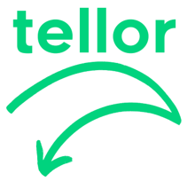

<p align="center">
  <a href='https://www.tellor.io/'>
    
  </a>
</p>

<p align="center">
  <a href='https://dapp.daxia.us/'>
    
  </a>
  <a href='https://deriveth.slack.com/'>
    
  </a>
  <a href='https://t.me/daxiachat'>
    
  </a>
  <a href='https://twitter.com/DaxiaOfficial'>
    
  </a> 
   
</p>

    
## Table of Contents
   * [Overview](#overview)
   * [Implementation](#implementation)
     * [Incentives](#incentives)
     * [Mining](#mining)
     * [Security](#security)
   * [Potential Applications](#potential-applications)
   * [Conclusion](#Conclusion)
   * [Updates](#Updates)

<details><summary>Contributing information</summary>

   * [Maintainers](#Maintainers)
   * [How to Contribute](#how2contribute)
   * [Copyright](#copyright)
 </details>

### Overview <a name="overview"> </a>
Ethereum smart contracts cannot access off-chain data. If your smart contract relies on off-chain (e.g. internet) data to evaluate or execute a function, you either have to manually feed the data to your contract, incentivize users to do it, or rely on a centralized party to provide the data (Oraclize.it is generally the standard).

The tellor oracle is a decentralized oracle. It provides a decentralized alternative for contracts to interact with and obtain data from off-chain (aka API data).

Tellor implements a hybrid Proof-of-work (PoW)/Proof-of-Stake (PoS) model where miners have to stake tellor tributes (tellor's native token) to be able to mine and along with the PoW solution they also provide an off-chain data point. The first five miners to provide the PoW and off-chain data point are rewarded: the miner with the median value is given the highest reward since that is what is used as the 'offical' value and the four miners get a lower reward that decreases the further they are from the median. Once validated and processed the value is available for on-chain contracts to use. The value can be disputed by anyone holding tellor tributes within 10 blocks after being mined for a fee. After the value goes to dispute, anyone holding tributes can vote on it's validity. If the vote determines the value was invalid the reporting party gets awarded the miner's stake, otherwise the wrongly acused miner gets the reporting fee.

<p align="center">

</p>

### Implementation <a name="Implementation"> </a>

Tellor provides an effective, secure system for off-chain data that requires inputs from five random parties(miners) and disincentives dispersion and adversarial submissions through the payout structure and a proof of work challenge that is chosen at random for each submission. 

The Tellor Oracle deploys only <b> one smart contact</b>. It holds and distributes the token supply, informs miners which values to submit, has a built in proof-of-stake methodology for challenges, and holds the historically mined values that contracts can read from. 

The contract provides the miners and users the API or data description, along with necessary fields for the data it is collecting and allows miners to submit the proof of work and off-chain data, sorts the values, allows the users to retrieve the values and to bid on which data series is mined next.  The contract allows for new values to be mined every 10 minutes and which data series is mined is determined by which series has the greatest tip going to the miners.  

Miners are required to stake tributes before they are allowed to mine. The <b>proofOfWork</b> function contains a require statement that ensures this. Once the miner is staked, the stake gets locked for the minimum stake period(one month) and if any dispute is raised against them during that period the stake gets locked until the dispute vote timeperiod expires. 

The basic flow for adding and retrieving data goes like this: 

1. The user submits <b>requestData</b> to the Oracle using Tributes to incentivize miners to choose the query over other submissions. The user needs to specify the API, timestamp and tip. Once a user submits a query the API will get an unique ID assigned to it and if the tip submitted for the request is larger than that of the current query on queue the current request will replace it via the <b>updateAPIonQ</b> function. 

These are the requestData and updateAPIonQ functions:
```solidity
    function requestData(string s_api, uint _timestamp, uint _tip) public returns(uint){
        bytes32 _api = stringToBytes32(s_api);
        if(apiId[_api] == 0){
            require(_tip>= requestFee && callTransfer(msg.sender,_tip));
            uint _apiId=apiIds.length+1;
            apiIdsIndex[_apiId] = apiIds.length;
            apiIds.push(_apiId);
            apiId[_api] = _apiId;
            api[_apiId] = _api;
            uint _time = _timestamp - (_timestamp % timeTarget);
            payoutPool[_apiId][_time] = payoutPool[_apiId][_time].add(_requestGas);
            updateAPIonQ (_apiId, _time);
            emit DataRequested(msg.sender,_api,_apiId,_time);
        }
        else{
            require(callTransfer(msg.sender,_tip));
            uint _time;
            if(_timestamp == 0){
                _time = timeOfLastProof + timeTarget;
            }
            else{
                _time = _timestamp - (_timestamp % timeTarget);
            }
            payoutPool[_apiId][_time] = payoutPool[_apiId][_time].add(_tip);
            updateAPIonQ (_apiId, _timestamp);
            emit ValueAddedToPool(msg.sender,_apiId,_tip,_time);
            return _apiId;
        }
    }

    function updateAPIonQ (uint _apiId, uint _timestamp) internal {
        uint _payout = payoutPool[_apiId][_timestamp];
        if (_payout > apiOnQPayout ) {
            apiOnQ = api[_apiId];
            apiOnQPayout = _payout;
            timeOnQ = _timestamp;
            emit NewAPIonQinfo(apiOnQ, timeOnQ, apiOnQPayout);
        } 
    }    
```
2. Other users who want the same API data, pay or ‘tip’ this data series so miners are further incentivized to mine it. If the API has already been requested, the <b>requestData</b> function will automatically add to the previously submitted query to create a pool and push the query up to queue.

3. Every 10 minutes, the Oracle provides a new challenge along with the data series for miners to mine. 

4. Miners can stake using the <b>depositStake</b> function and the stake will be locked for a minimum time period. Also, if a dispute against a miner is raised, the stake is locked through the dispute process. Contact us if you are interested on becoming an early miner. 

5. Miners then submit their PoW solution, API ID, and off-chain data point to the Oracle contract via the <b>proofOfWork</b> function. The Oracle contract sorts the values as they come in(via the <b>pushValue</b> function) and as soon as five values are received the official value is selected and saved on-chain. The miners are then allocated their payout (base reward and tips). the miner with the median value is given the highest reward since that will become the 'official' value and the other four miners get a lower reward that decreases the further they are from the median. The next API to mine is set at this time based on the current API on queue or the API with the highest payout. This allows the users to bid their request up to the queue until the next value is mined.  

```solidity
    function proofOfWork(string calldata nonce, uint _apiId, uint value) external returns (uint256,uint256) {
        require(getStakeAmt(msg.sender)>0);
        bytes32 _solution = keccak256(abi.encodePacked(currentChallenge,msg.sender,nonce)); // generate random hash based on input
        bytes32 n = sha256(abi.encodePacked(ripemd160(abi.encodePacked(_solution))));
        require(uint(n) % difficulty == 0 && _apiId == miningApiId && value > 0 && miners[currentChallenge][msg.sender] == false); //can we say > 0? I like it forces them to enter a valueS  
        first_five[count].value = value;
        first_five[count].miner = msg.sender;
        count++;
        miners[currentChallenge][msg.sender] = true;
        uint _payoutMultiplier = 1;
        emit NonceSubmitted(msg.sender,nonce,_apiId,value);
        if(count == 5) { 
        uint _timediff = now - timeOfLastProof;
        int _diff = int(_timediff - timeTarget);
        if(count == 5) { 
            if (_diff != 0){
                difficulty = difficulty - _timediff/60;
            }

            uint i = (now - (now % timeTarget) - timeOfLastProof) / timeTarget;
            timeOfLastProof = now - (now % timeTarget);
            uint valuePool;
            while(i > 0){
                valuePool += payoutPool[_apiId][timeOfLastProof - (i - 1) * timeTarget];
                i = i - 1;
            }
            if(valuePool >= payoutTotal) {
                _payoutMultiplier = (valuePool + payoutTotal) / payoutTotal; //solidity should always round down
                payoutPool[_apiId][timeOfLastProof] = valuePool % payoutTotal;
            }
            else{
                payoutPool[_apiId][timeOfLastProof] = valuePool;
            }
            pushValue(_apiId, timeOfLastProof,_payoutMultiplier);
            minedBlockNum[_apiId][timeOfLastProof] = block.number;
            miningApiId = apiId[apiOnQ]; 
            timeToApiId[timeOfLastProof] = _apiId;
            timestamps.push(timeOfLastProof);
            count = 0;
            currentChallenge = keccak256(abi.encodePacked(nonce, currentChallenge, blockhash(block.number - 1))); // Save hash for next proof
         }
        return (count,timeOfLastProof); 
        }
    }

    function pushValue(uint _apiId, uint _time, uint _payoutMultiplier) internal {
        Details[5] memory a = first_five;
        uint[5] memory _payout;
        uint i;
        for (i = 1;i <5;i++){
            uint temp = a[i].value;
            address temp2 = a[i].miner;
            uint j = i;
            while(j > 0 && temp < a[j-1].value){
                a[j].value = a[j-1].value;
                a[j].miner = a[j-1].miner;   
                j--;
            }
            if(j<i){
                a[j].value = temp;
                a[j].miner= temp2;
            }
        }
        for (i = 0;i <5;i++){
            _payout[i] = payoutStructure[i]*_payoutMultiplier;
        }
        batchTransfer([a[0].miner,a[1].miner,a[2].miner,a[3].miner,a[4].miner], _payout,true);
        devTransfer(address(this),(payoutTotal * devShare / 100));
        values[_apiId][_time] = a[2].value;
        minersbyvalue[_apiId][_time] = [a[0].miner,a[1].miner,a[2].miner,a[3].miner,a[4].miner];
        emit Mine(msg.sender,[a[0].miner,a[1].miner,a[2].miner,a[3].miner,a[4].miner], _payout);
        emit NewValue(_apiId,timeOfLastProof,a[2].value);
    }
```

6. Anyone holding Tellor Tributes can dispute the validity of a mined value within 10 blocks of it being mined by “staking” a fee via the <b> initDispute </b> function.  Tribute holders will vote on the validity of the data point. If the vote determines the value was invalid the reporting party gets awarded the miner's stake, otherwise the wrongly acused miner gets the reporting fee. Votes are weighted based on the amount of tributes held by the mining party at the time of voting (block.number). The miner under dispute is barred from voting. 


7. The data is available on-chain for everyone to read via the <b>retreiveData</b> and <b>getLastQuery</b> functions.

### Incentives <a name="incentives"> </a>
Two types of incentives are implented in this hybrid model, 1) rewards for PoW submissions and 2) structural incentives to promote accurate value submissions. 

The next subsections provide further details and goals of the reward incentives and on how the miners are incentivised to provide accurate values. 

### 1. Rewards for PoW submissions

Miners are given two types of rewards for the PoW:
* [A base reward per every successful submission](#base-reward) 
* [Tips given to miners to incentivize the selection of algorithm](#tips)

The next two subsections provide further details and goals of these.

#### A base reward per every successful submission <a name="base-reward"> </a>
The base reward incentivizes miners to provide data via the PoW and its pay structure incentivises them to provide accurate values. 

Similar to the way Ethereum rewards ‘Uncles’ or miners who were close to winning, the first five miners to submit a PoW, API ID and off-chain value are awarded tributes. The miner that submits the median value is awarded the largest quantity of the total payoff. The median value is selected efficiently via an insert sort in the <b>pushValue</b> function called withing the <b>proofOfWork</b> function.

The current incentive structure leverages game-theory to disincentivize dispersion and adversarial submissions. The payout structure is specified when deploying a new oracle. 


Tellor Base Reward Mechanism  

<p align="center">

</p>


Miners are rewarded with tributes. Trubutes are charged for API requests. This gives each token value, and more importantly, the value goes up as more smart contracts use our Oracle, thus creating a stronger incentive for miners to continue to mine and provide accurate values.


#### Tips given to miners to incentivize the selection of algorithm <a name="tips"> </a>

Users incentivize miners to retrieve their value by posting a bounty to ensure the query they are interested on is mined. Akin to paying a higher gas fee for a prioritized transaction, this is a tip to the miners and is paid out in the same staggered reward structure as the base reward. As the ecosystem expands (increasing number of DApps and the value hosted on these), securing data to finalize or execute a contract will lead to higher tips and higher incentivization of miners to continue to mine.

Since the time target of the oracle is 10 minutes, there are only 144 queries per day on average.  As the Tellor oracle is adopted, the queue will fill and price competitions will take place.  This is a self fulfilling cycle as adoption increases so does demand, miner rewards, security and further adoption. 


### 2. Structural incentives to promote accurate value submissions

Miners are incentivized to provide accurate values through 3 processes:
* [Mining rewards are based upon submission of median value](#uncles)
* [Every miner required to stake 1000 tokens](#staking)
* [Every accepted value can be challenged and put to vote by all Tellor Tribute holders](distputes)

The next three subsections provide further details and goals of these.

#### Mining rewards are based upon submission of median value <a name="uncles"> </a>
Uncle rewards can be used to reduce the chance of a miner gaining 51% of hashing power a smart contract pays miners to mine uncles. The Tellor Oracle utilizes uncles by rewarding  five miners per data value instead of just one. 

#### Every miner required to stake 1000 tokens <a name="staking"> </a>
Miners have to stake 1000 Tributes to be able to mine. Proof-of-stake allows for economic penalties to miners submitting incorrect values. Parties pay to report a miner providing false data, which leads to the report going to a vote (all Tribute holders can vote, the duration of the vote dictates how long the “bad” miner is frozen from mining).  If found guilty, the malicious miner’s stake goes to the reporter; otherwise the fee paid by the reporter is given to the wrongly accused miner. 

#### Every accepted value can be challenged and put to vote by any Tellor token holder <a name="disputes"> </a>
Blockchains are secured via multiple avenues.  The first is in the random selection process provided by PoW.  The second is that even if the first security measure fails, the blockchain can create forks and different chains until the honest miners win out.  Since our oracle system does not have the ability to fork easily, Tellor implements a finality period of 10 blocks after original data submissions.  This allows for parties to challenge data submissions and multiplies the cost to break the network by the number implicit successful confirmations needed (10 blocks without a challenge). 


#### Mining <a name="mining-process"> </a>
One of the main challenges for a mineable token or any process that relies on mining is that there are many ASICS currently available and if used on a small ecosystem these specialized systems can quickly monopolize it. Daxia's proof of work challenge is designed to be different that Bitcoin mining challenge. The challenge is chosen at random from three possible options for each submission. This setup requires miners to invest significant amount of time to update the mining algorithm and should disincentivize miners to become part of the ecosystem too early, allowing it to grow and mature before larger players join. 

The PoW, is basically guessing a nonce that produces a hash with a certain number of leading zeros using the randomly selected hash function. The PoW challenge is chosen at random from the three challenges included in the proofOfWork function and the difficulty for the PoW is adjusted to target 10 minutes. However, the difficulty only increases if the previous challenge is solved faster than 60% of the timetarget. If it was a hard cutoff, it ran a higher risk of the next value failing submission if it takes longer than the time target to mine or be added to the Ethereum mainnet.   Miners can submit the PoW and the off-chain value using the function proofOfwork in OracleToken.sol. 

The mining process is formally expressed as:


An implementation of the miner is described in python in the 'miner' sub directory.  In 'miner.py', the script imports the web3 library, pandas, and various other dependencies to solve the keccak256, sha256, and ripemd160 puzzle.  In submitter.js, the nonce value inputs are submitted to the smart contract on-chain.  To examine the mining script, navigate [here](./miner/).


The official value appended to the timeseries is determined by a decentralized mechanism where five values are collected before the official value is selected.  The first five values received are sorted as they are submitted and the miner with the median value is given the highest reward since that will become the 'official' value and the other four miners get a lower reward that decreases the further they are from the median. Once validated and processed the value is available for on-chain contracts to use.

The data collection is decentralized since mining, and by extension data submission, is open to everyone who stakes. To avoid dispersion, incentives are structured to provide the highest reward to the miner that submits the median value. Using the median value instead of the average protects the value from being manipulated by a single party submitting an extreme value. To ensure data availability, multiple parties are incentivized to submit data by rewarding the first five miners that submit the PoW and of-chain data point. 

During the time that the value is being confirmed (10 blocks), parties can challenge this submission.  The challenge and data value are put up to vote by Tribute holders.  This is described in detail in the Security section.

## Potential Applications <a name="potential-applications"> </a>

Within the context of Ethereum, oracles can be thought of as authoritative sources of off-chain data. These data points allow smart contracts to receive and condition executional instructions using extrinsic information.  This is highly useful for a wide-array of derivative scenarios.

As Tellor is a contract mechanism that allows oracle data to be derived in a competitive, decentralized manner - we envision a wide array of use cases for this product.  Namely:
1. <b>Exchange-rate data:</b> interval based exchange-rate values may be used to create trustless financial derivatives
2. <b>Weather data logs:</b> for example, we may calculate insurance premium calculation based on a weather forecast
3. <b>Static/pseudo-static data:</b> logging and indexing various identifiers, country codes, currency codes
4. <b>Prediction Market Probability/Odds:</b> i.e. "What is the likelihood that X event will happen"
5. <b>Prediction Market Resolution:</b> i.e. determining who won the most recent presidential election or sporting event
6. <b>Damage verification:</b> What were the net total results in damage for insurance contracts
7. <b>Pseudorandom number generation:</b> to select a winner in a distributed-lottery smart contract, etc.


## Conclusion <a name="conclusion"> </a>
Tellor provides a decentralized option for off-chain data. We realize the short coming of PoW but as of now it has proven to work and we are providing users a way to move away from it once a better option comes along.  

By creating an oracle schema that uses an incented construct to derive the validity of off-chain data, we:
* <b>Reduce the risks</b> associated with single-party oracle providers, who can cut access to API data, forge message data, etc
* <b>Lay the foundation</b> for a superior oracle system where data is derived from a distributed set of participants which have both economic interest and 'stake' in the validity and success of the oracle data
* <b>Create</b> an effective, secure, and incentivized system for off-chain data which ingests inputs from five random parties(miners) and disincentives dispersion and adversarial submissions 

#### Maintainers <a name="maintainers"> </a> 
[@themandalore](https://github.com/themandalore)
<br>
[@brendaloya](https://github.com/brendaloya) 


#### How to Contribute<a name="how2contribute"> </a>  
Join our slack, shoot us an email or contact us: [](https://deriveth.slack.com/)
[](https://t.me/ddaorg)
[](https://discordapp.com/invite/xtsdpbS)

Check out or issues log here on Github or contribute to our future plans to implement a GPU miner(not built in python), provide a way to pay in Ether for data, and improve our reward/incentives mechanism. 

Any contributions are welcome!

#### Copyright

DDA Inc. 2018