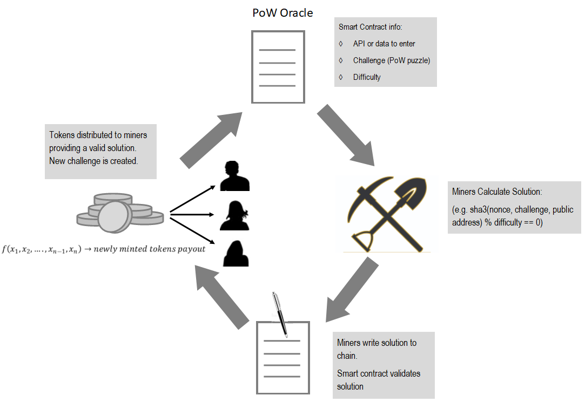
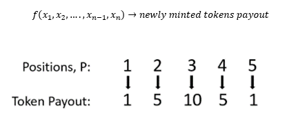

# Proof of Work Oracle (PoWO)

<b>Proof of Work Oracle (PoWO)</b> is a decentralized oracle governed by the PoWO token owners. It provides a decentralized alternative for contracts to interact and obtain data from the off-chain world. 

The PoWO implements proof of work (PoW) where miners compete to solve a challenge and along with the PoW they also provide an off-chain value.  Once validated and processed the value is available for on-chain decentralized contracts to use.  

<details><summary>Table of Contents</summary>

1. [Instructions for quick start with Truffle Deployment](#Quick-Deployment)
2. [Documentation](#Documentation)
    * [Contracts Description](#Contracts-Description)
    * [Scripts Description](#Scripts-Description)
    * [Operator Setup](#operator-setup)
    * [User functions](#user-fx)
    * [Miner function](#miner-fx)

3. [Overview](#overview)
    * [How Does it work?](#how-it-works)
    * [The Oracle Mining Process](#mining-process)
    * [Example Usage Scenarios](#usage-scenarios)
    * [Conclusion](#Conclusion)
    * [Updates](#Updates)
</details>



### Instructions for quick start with Truffle Deployment <a name="Quick-Deployment"> </a> 
Follow the steps below to launch the Oracle contracts using Truffle. 

Clone the repo, cd into it, and then run:

    $ npm install

    $ truffle compile

    $ truffle migrate

    $ truffle exec scripts/01_DeployAndVoteOnDudOracle.js

    $ truffle exec scripts/02_TallyVotesForDudOracle.js

    $ truffle exec scripts/03_TallyVotesForProposedOracles.js

Get at least 5 miners going.

Production and test python miners are available under the miner subdirectory [here](./miner/).

#### How to Contribute<a name="how2contribute"> </a>  
Join our slack, shoot us an email or contact us: [](https://deriveth.slack.com/)
[](https://t.me/ddaorg)
[](https://discordapp.com/invite/xtsdpbS)

Check out or ussues log here on Github or contribute to our future plans to implement a GPU miner(not built in python), provide a way to pay in Ether for data, and improve our reward/incentives mechanism. 

Any contributions are welcome!

## Documentation <a name="Documentation"> </a>  
The documentation is broken down into three parts: contracts descriptions, scripts (javascript) descriptions, and steps for setting up, using and mining. 

### Contracts Description <a name="Contracts-Description"> </a>
* <b>OracleToken.sol</b> -- is the Oracle contract. It allows miners to submit the proof of work and value, sorts the values, uses functions from ProofOfWorkToken to pay the miners, allows the data users to "tip" the miners for providing values and allows the users to retrieve the values.

    * Notable functions under OracleToken.sol:
        * retrieveData -- use this function to retrieve data
        * addToValuePool -- use this function to add a tip (additional reward) for miners to ensure the next datapoint is mined
        * proofOfWOrk -- used for miners to submit the PoW and off-chain value. It automatically adjusts the difficulty level to the target time.
        * pushValue -- used by proofOfWork to sort the values as they come in and pay out the miners

* <b>OracleVote.sol</b> -- contains the voting mechanism for adding, removing and changing oracles(uses balance checkpoints to avoid double voting), minting, paying the miners, ERC20 token functionality, and cloning process for efficiently deploying new oracles. Oracle vote contains all the functions (is) in ProofOfWorkToken.sol, CloneFactory.sol and Token.sol.

    * <b>ProofOfWorkToken.sol</b> -- contains all the functionality to set an origin(dud) oracle, deploy new oracles, remove oracles, and pay the miners. 

    * <b>CloneFactory.sol</b> -- allows ProofOfWorkToken to create and deploy an oracle efficiently. It creates a "clone" the dud oracle. The dud oracle acts as a byte code library for all the oracle contracts deployed based on it. To over simplify it is similar to how contracts reference the SafeMath library. Checkout our article, [Attack Of The Clones-How DDA Contracts Are So Cheap To Deploy](https://blog.goodaudience.com/attack-of-the-clones-how-dda-contracts-are-so-cheap-to-deploy-f3cee9c7566)

    * <b>Token.sol</b> -- contains all the ERC20 token functionality for the PoWO Token

    * Notable functions under OracleVote.sol:
        * addOracle -- use to propose to add an oracle
        * removeOracle -- use to propose to remove an oracle
        * changeDudOracle -- use to propose to switch from PoW to PoS
        * changeMinQuorum -- use to propose to change the minimum quorum for the vote
        * changeVoteDuration -- use to propose to change the vote duration for the proposals
        * changeProposalFee -- use to propose to change the fee for each proposal
        * vote -- use this function to vote on proposals
        * tallyVotes -- use this function to tally the votes. It is the only function that can add, remove, or change an oracle or change the proposal fees, minimum quorum and vote duration.


Note: There is no owner for the OracleToken.sol or OracleVote.sol, these are managed and governed by the PoWO token owners.  

### Scripts Description <a name="Scripts-Description"> </a>

* <b>01_DeployAndVoteOnDudOracle.js</b> -- deploys the OracleVote and proposes the Oracle dud (origin).  

    * To deploy OracleVote update the proposal fee, minimum quorum and vote duration. The vote duration has to be specified in days.

        * Before the votes can be tallied (tallyVotes function is ran) the vote duration needs to pass (keep in mind that for production deployments you may have to wait a day before being able to set the dud oracle).

        * For testing, line 200 in OracleVote.sol can be commented out.

        * Note: The tallyVotes function is the only function that can add/deploy, remove, change the dud oracle, vote duration, minimum quorum required to pass a proposal, and the proposal fee.

    ```solidity
OracleVote(uint _proposalFee, uint _minimumQuorum, uint _voteDuration)
    ```

    * To deploy OracleToken update OracleVote address, read fee, time target for PoW and payout structure.

    ```solidity
OracleToken(address _master,uint _readFee,uint _timeTarget,uint[5] _payoutStructure)
    ```

* <b>02_TallyVotesForDudOracle.js</b> -- Tallies the votes for the dud oracle, proposes two new oracles based on it, a daily and a 10 minute interval for Bitcoin and votes on them. For production environments, the vote duration timeframe has to elapse before the tallyVotes function can be ran. 

* <b>03_TallyVotesForProposedOracles.js</b> -- Tallies the votes for the two new oracles proposed and if the vote is successful it will deploy them. 

### Operator Setup <a name="operator-setup"> </a>  
The setup documentation is noted for acting as the operator.  Specific contract details are laid out for ease of use regardless of dev environment. Note that since the OracleToken is designed to be governed by a decentralized autonomous organization (DAO)/everyone that owns the PoWO tokens, the operator will eventually cede control to the PoWO owners.

**Step 1: Operator - Deploy oracleVote.sol**  
The OracleVote contract contains the functionallity for the DAO, minting, and paying the miners. The cost to propose(\_proposalFee), minimum quorum to pass a vote (\_minimumQuorum), and how long the PoWO owners will have to cast their vote in days (\_voteDuration) will nave to be specified on deployment. 

```solidity
OracleVote(uint _proposalFee, uint _minimumQuorum, uint _voteDuration)
```
**Step 2: Operator - Deploy oracleToken.sol**  
The first deployed oracleToken.sol will serve as a bytes library for future oracleToken.sol deployment. We refer to this first deployment as the "dud oracle" and it is used as the "clone" source for future proposed oracles.

The constructor arguments on the dud oracle do not affect future proposed oracles. But these are needed for successful deployment of the contract. The \_master address will be set to the OracleVote address automatically on future oracles, however, for the dud it has to be specified along with the rest of the constructor arguments. 

```solidity
OracleToken(address _master,uint _readFee,uint _timeTarget,uint[5] _payoutStructure)
```
where: 
* \_master -- is the OracleVote address
* \_readFee -- is the fee(number of PoWO) users will be charged for data reads
* \_timeTarget -- is the time target for the difficulty adjustment and determines how often values will be saved to the oracle timeseries
* \_payoutStructure -- is used to specify how the readFee will be distributed among the five miners

**Step 3: Operator - Propose and vote on the dud oracle**  
Setting the dud oracle has to be decided by the PoWO holders. The operator has to propose to set the dud oracle to the address of the deployed oracleToken.sol on step 2. The operator is assigned 1,000,000 PoWO when oracleVote is deployed (see line 33 in Token.sol). Once the dud oracle is proposed, the opearator will have to vote for it and wait the vote duration period before tallying up the votes.

```javascript
oraclevote = await oracleVote.at(address _oraclevote);
oraclevote.propDudOracle(address _dudOracle);
oraclevote.vote(uint _proposalId, bool _supportsProposal);
```
where:
* \_dudOracle -- is the address of OracleToken.sol deployed on step 2
* \_proposalID -- is the proposal ID emitted from propDudOracle (in this case it should be 1)
* \_supportsProposal -- is used to cast a vote, use true to vote for and false to vote against

**Step 4: Operator - Set dud oracle, propose and vote on new oracle**  
The tallyVotes function is the only function that can add/deploy, remove, change the dud oracle, vote duration, minimum quorum required to pass a proposal, and the proposal fee and can only be ran once the vote duration timeframe expires.

```javascript
oraclevote = await oracleVote.at(address _oraclevote);
oraclevote.tallyVotes(uint _proposalId);
oraclevote.propAdd(string _api,uint _readFee, uint _timeTarget,uint[5] _payoutStructure);
oraclevote.vote(uint _proposalId, bool _supportsProposal);
```
where:
* \_oracleVote -- is the OracleVote address deployed on step 1
* \_proposalId -- is the proposal ID for the dud oracle proposed on step 3
* \_api -- is the proposed oracle api
* \_readFee -- is the proposed fee for reading oracle information
* \_timeTarget -- is the proposed time for the difficulty adjustment in unix time
* \_payoutStructure -- is the proposed payout structure for miners
* \_proposalID -- is the proposal ID emitted from propAdd
* \_supportsProposal -- is used to cast a vote, use true to vote for and false to vote against

Once the new oracle is proposed, the operator will have to vote for it and wait the vote duration period before tallying up the votes.

**Step 5: Operator - Tally votes to set new oracle**  
Once the dud oracle is set all the new oracles "clone" it's functionallity. The tallyVotes function will deploy the new oracle and use the oracleVote.address as its master address.

```javascript
oraclevote.tallyVotes(uint _proposalId);
```

where:
* \_proposalId -- is the proposal ID for the dud oracle proposed on step 4

### User functions <a name="user-fx"> </a>  
Once the operator deploys OracleVote, sets the dud oracle and deploys an oracle, users or on-chain contracts can retrieve data and tip miners to increase incentive to have the next data point mined.

Users can buy the ERC-20 PoWO token via an exchange or mine them.

**Users: Retreive data**  
Use the function retrieveData to retrieve data.

```javascript
oracleToken.retrieveData(uint _timestamp);
```
where:
* \_timestamp -- is the unix timestamp to retrieve a value from

**Users: Tip miners**  
Use the function addToValuePool to add PoWO tokens rewards for miners and ensure they mine the next block/value.

```javascript
oracleToken.addToValuePool(uint _tip);
```
where:
* \_tip -- is the amount of PoWO tokens to add to the value pool for miners

### Miner function <a name="miner-fx"> </a>  
Miners can use the proofOfWork function to submit the PoW and off-chain value. Production and test python miners are available under the miner subdirectory [here](./miner/).  In the future, we plan to switch to a GPU miner (not built on python) but this will suffice for now for the proof of concept.

```javascript
oracleToken.proofOfWork(string nonce, uint value)
```
where 
* nonce -- is the string submitted by miner
* value -- is the value of api query


## Overview <a name="overview"> </a>  
Ethereum smart contracts cannot access off-chain data. If your smart contract relies on off-chain (e.g. internet) data to evaluate or execute a function, you either have to manually feed the data to your contract, incentivize users to do it, or rely on a centralized party to provide the data (Oraclize.it is generally the standard). 

To avoid a centralized option or the less proven Proof of Stake method, the PoWO uses the proven method of PoW and requires miners to submit the PoW along with an off-chain value. We have implemented PoW because it is reliable, <b>now</b>. However, PoWO owners can decide to switch from PoW to Proof of Stake (PoS).

The PoWO is governed by all PoWO owners. The PoWO owners can propose and vote to switch from PoW to PoS, add or remove an oracle, change the minimum quorum or vote duration for a vote to execute, and change the proposal fee.

Votes are weighted based on the amount of PoWO tokens owned at the point in time (checkpoint) votes are tallied.

Checkout our article, [Proof-of-Work Oracle](https://medium.com/@nfett/proof-of-work-oracle-6de6f795d27) for a quick  overview. 

### How Does it work? <a name="how-it-works"> </a>

Once a dud (origin) oracle contract is voted on and deployed, the new proposed oracles are "cloned" from the dud oracle (i.e. they use the dud oracle as a bytes library). All new proposals for new oracles specify the type of data (e.g. an API) to be submitted along with the PoW. The difficulty for the PoW is adjusted to target 10 minutes. Similar to the way Ethereum rewards ‘Uncles’ or miners who were close to winning, the first five miners to submit a PoW and off-chain value are awarded the native PoWO token. The miner that submits the median value is awarded a larger quantity of the total payoff. The payout structure can be specified when proposing a new oracle. 

Proof Of Work Oracle Reward Mechanism  

<div style="text-align:center">


</div>

The current incentive structure leverages game-theory to disincentivize dispersion and adversarial submissions.

Once the median value is selected, it is stored, and a new challenge is created. The median value is selected efficiently via an insert sort in the pushValue function used within the OracleToken contract proofOfWork function:

```solidity
    function pushValue(uint _time) internal {
        Details[5] memory a = first_five;
        emit Print2([a[0].miner,a[1].miner,a[2].miner,a[3].miner,a[4].miner],payoutStructure);
        for (uint i = 1;i <5;i++){
            uint temp = a[i].value;
            address temp2 = a[i].miner;
            uint j = i;
            while(j > 0 && temp < a[j-1].value){
                a[j].value = a[j-1].value;
                a[j].miner = a[j-1].miner;   
                j--;
            }
            if(j<i){
                a[j].value = temp;
                a[j].miner= temp2;
            }
        }
        emit Print(payoutStructure[0],payoutMultiplier);
        ProofOfWorkToken(master).batchTransfer([a[0].miner,a[1].miner,a[2].miner,a[3].miner,a[4].miner], [payoutStructure[0]*payoutMultiplier,payoutStructure[1]*payoutMultiplier,payoutStructure[2]*payoutMultiplier,payoutStructure[3]*payoutMultiplier,payoutStructure[4]*payoutMultiplier]);
        values[_time] = a[2].value;
        emit Mine(msg.sender,_time,a[2].value); // execute an event reflecting the change
    }
```

As miners submit the PoW and off-chain value, the value is sorted and as soon as five values are received, the median value (integer) and the timestamp (Unix timestamp) are saved to create an on-chain timeseries.

Miners are rewarded with PoWo tokens. PoWO tokens are charged for on-chain reads. This gives each token value, and more importantly, the value goes up as more smart contracts use our Oracle, thus creating a stronger incentive for miners.

Additionally, users can incentivize miners by posting a bounty via the addToValuePool function to ensure the next timestamp is mined. This function basically allows users to tip the miners.

#### The Oracle Mining Process <a name="mining-process"> </a>
The current challenge, adjusted difficulty, count, and proof since last timestamp are all called during the 'proofOfWork' operation/function. The PoW, is basically guessing a nonce that produces a hash with a certain number of leading zeros. Miners can submit the PoW and the off-chain value using the function proofOfwork in OracleToken.sol.

The mining process is formally expressed as:

```solidity
    function proofOfWork(string nonce, uint value) external returns (uint256,uint256) {
        bytes32 n = keccak256(abi.encodePacked(currentChallenge,msg.sender,nonce)); // generate random hash based on input
        require(uint(n) % difficulty == 0 && value > 0 && miners[currentChallenge][msg.sender] == false);   
        first_five[count].value = value;
        first_five[count].miner = msg.sender;
        count++;
        miners[currentChallenge][msg.sender] = true;
        emit NewValue(msg.sender,value);
        if(count == 5) { 
            if (now - timeOfLastProof< timeTarget){
                difficulty++;
            }
            else if (now - timeOfLastProof > timeTarget && difficulty > 1){
                difficulty--;
            }
            timeOfLastProof = now - (now % timeTarget);
            emit Print(payoutTotal,valuePool);
            if(valuePool >= payoutTotal) {
                payoutMultiplier = (valuePool + payoutTotal) / payoutTotal; //solidity should always round down
                valuePool = valuePool - (payoutTotal*(payoutMultiplier-1));
            }
            else{
                payoutMultiplier = 1;
            }
            pushValue(timeOfLastProof);
            count = 0;
            currentChallenge = keccak256(abi.encodePacked(nonce, currentChallenge, blockhash(block.number - 1))); // Save hash for next proof
        }
         return (count,timeOfLastProof); 
    }
```

An implementation of the miner is described in python in the 'miner' sub directory.  In 'miner.py', the script imports the web3 library, pandas, and various other dependencies to solve the keccak256 puzzle.  In submitter.js, the nonce value inputs are submitted to the smart contract on-chain.  To examine the mining script, navigate [here](./miner/).

## Example Usage Scenarios <a name="usage-scenarios"> </a>

As PoWO is a contract mechanism that allows oracle data to be derived in a competitive, decentralized manner - we envision a wide array of use cases for the OracleToken smart-contract.  Namely:
1. <b>Exchange-rate data:</b> interval based exchange-rate truthpoints may be used to create trustless financial derivatives [ala Decentralized Derivitives](https://github.com/decentralizedderivatives/)
2. <b>Weather data logs:</b> for example, we may calculate insurance premium calculation based on a weather forecast
3. <b>Static/pseudo-static data:</b> logging and indexing various identifiers, country codes, currency codes
4. <b>Prediction Market Probability/Odds:</b> i.e. "What is the likelihood that X event will happen"
5. <b>Prediction Market Resolution:</b> i.e. determining who won the most recent presidential election or sporting event
6. <b>Damage verification:</b> What were the net total results in damage for insurance contracts
7. <b>Pseudorandom number generation:</b> to select a winner in a distributed-lottery smart contract, etc.


## Conclusion <a name="conclusion"> </a>
The PoWO provides a decentralized option for off-chain data. We realize the short comming of PoW but as of now it has proven to work and we are providing users a way to move away from it once a better option comes along.  

By creating an oracle schema that uses an incented construct to derive the validity of off-chain data, we:
* <b>Reduce the risks</b> associated with single-party oracle providers, who can cut access to API data, forge message data, etc
* <b>Lay the foundation</b> for a superior oracle system where data is derived from a distributed set of participants which have both economic interest and 'stake' in the validity and success of the oracle data
* <b>Create</b> an effective, secure, and incentivized system for off-chain data which ingests inputs from five random parties(miners) and disincentives dispersion and adversarial submissions 

### Updates <a name="updates"> </a>
We are happy to report that a successful PoWO build has successfully compiled and been deployed to the Rinkeby testnet. 

July 8, 2018--this project was a submission to <b>Angel Hack's Washington DC Hackathon</b> hosted on July 7th - 8th.  It was designed, spec'ed, built, and deployed in a 24-hour agile sprint.

September 30, 2018--This project has been revised to improve efficiency and a DAI has been added for governance.

<i>We invite you</i> to audit and test our project - and submit any issues to the repo directly.

### Useful links <a name="useful-links"> </a>
High level inspiration from [EIP918 Mineable Token](https://github.com/ethereum/EIPs/blob/master/EIPS/eip-918.md).

Why we need a decentralized option? Checkout: ["Trusted third parites are security holes" ~ Nick Szabo, 2001](https://nakamotoinstitute.org/trusted-third-parties/)

Metamask - www.metamask.io 

Truffle - http://truffleframework.com/

If you have questions, ask us on Slack: https://deriveth.slack.com/

#### Contributors<a name="contributors"> </a>

Nicholas Fett (nfett@decentralizedderivatives.org), Kevin Leffew (kleffew94@gmail.com), Sam Everett (severett29@gmail.com), Brenda Loya (bloya@decentralizedderivatives.org), Lucian Stroie (luciandstroie@gmail.com)


#### Copyright
MIT License [link.](https://github.com/SamuelLJackson/AngelHackTeam/blob/master/LICENSE)
