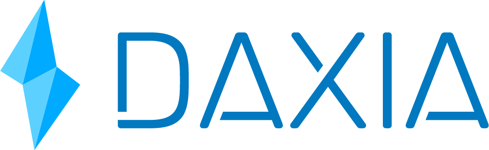

<p align="center">
  <a href='https://www.daxia.us/'>
    
  </a>
</p>

<p align="center">
  <a href='https://dapp.daxia.us/'>
    
  </a>
  <a href='https://deriveth.slack.com/'>
    
  </a>
  <a href='https://t.me/daxiachat'>
    
  </a>
  <a href='https://twitter.com/DaxiaOfficial'>
    
  </a> 
   
</p>

## Table of Contents
*  [Documentation](#Documentation)
    * [Operator Setup](#operator-setup)
      * [Testing](#testing)
    * [User functions](#user-fx)
    * [Miner function](#miner-fx)
    * [Contracts Description](#Contracts-Description)
    * [Scripts Description](#Scripts-Description)

 <details><summary>Contributing information</summary>

   * [Maintainers](#Maintainers)
   * [How to Contribute](#how2contribute)
   * [Copyright](#copyright)
 </details>

## Documentation <a name="Documentation"> </a>  
The documentation is broken down into three parts: steps for setting up, users and miners functions, contracts descriptions, and scripts (javascript) descriptions.


### Operator Setup <a name="operator-setup"> </a>  
The setup documentation is noted for acting as the operator.  Specific contract details are laid out for ease of use regardless of dev environment. 

**Step 1: Operator - Deploy ProofOfWorkToken.sol**  
The ProofOfWorkToken contract contains all the functionality to set an origin(dud) oracle, deploy new oracles, remove oracles, and pay the miners. The operator is assigned 1,000,000 PoWO when ProofOfWorkToken is deployed (see line 33 in Token.sol).

```solidity
ProofOfWorkToken()
```
**Step 2: Operator - Deploy OracleToken.sol**  
The first deployed oracleToken.sol will serve as a bytes library for future oracleToken.sol deployment. We refer to this first deployment as the "dud oracle" and it is used as the "clone" source for future proposed oracles.

The constructor arguments on the dud oracle do not affect future proposed oracles. But these are needed for successful deployment of the contract. The \_master address will be set to the ProofOfWorkToken address automatically on future oracles, however, for the dud it has to be specified along with the rest of the constructor arguments. 

```solidity
OracleToken(address _master,uint _readFee,uint _timeTarget,uint[5] _payoutStructure)
```
where: 
* \_master -- is the ProofOfWorkToken address
* \_readFee -- is the fee(number of PoWO) users will be charged for data reads
* \_timeTarget -- is the time target for the difficulty adjustment and determines how often values will be saved to the oracle timeseries
* \_payoutStructure -- is used to specify how the readFee will be distributed among the five miners

**Step 3: Operator - Set dud oracle, and deploy a new oracle**  
The tallyVotes function is the only function that can add/deploy, remove, change the dud oracle, vote duration, minimum quorum required to pass a proposal, and the proposal fee and can only be ran once the vote duration timeframe expires.

```javascript
ProofOfWorkToken = await ProofOfWorkToken.at(address _ProofOfWorkToken);
proofofworktoken = await proofOfWorkToken.new();
await proofofworktoken.setDudOracle(oracletoken.address);
await proofofworktoken.deployNewOracle(string _api,uint _readFee,uint _timeTarget,uint[5] _payoutStructure); (e.g. 'json(https://api.gdax.com/products/BTC-USD/ticker).price',22,timeframe,[1,5,10,5,1])
```
where:
* \_dudOracle -- is the address of OracleToken.sol deployed on step 2
* \_api -- is the proposed oracle api
* \_readFee -- is the proposed fee for reading oracle information
* \_timeTarget -- is the difficulty adjustment time target or how often you want to save data points
* \_payoutStructure -- is the proposed payout structure for miners

#### Testing

1. Open a second terminal and run:
```solidity
   $ ganache-cli -m "nick lucian brenda kevin sam fiscal patch fly damp ocean produce wish"
```
2. On main terminal run: 
```solidity
    $   truffle test
```
3. And wait for the message 'START MINING RIG!!'
4. Kick off the python miner file [./miner/testMinerB.py](./miner/testMinerB.py).

Production and test python miners are available under the miner subdirectory [here](./miner/). You will need to get at least 5 miners running.

### User functions <a name="user-fx"> </a>  
Once the operator deploys ProofOfWorkToken, sets the dud oracle and deploys an oracle, users or on-chain contracts can retrieve data and tip miners to increase incentive to have the next data point mined.

Users can buy the ERC-20 PoWO token via an exchange or mine them.

<b>Overview</b> :(https://medium.com/@nfett/proof-of-work-oracle-6de6f795d27)

Users engage in a POW competition to find a nonce which satisfies the requirement of the challenge.  The first five users who solve the POW puzzle input data for the POW Oracle contract and receive native tokens in exchange for their work.  The oracle data submissions are stored in contract memory as an array - which is subsequently operated upon to derive the median value. 

```javascript
oracleToken.retrieveData(uint _timestamp);
```
where:
* \_timestamp -- is the unix timestamp to retrieve a value from

**Users: Tip miners**  
Use the function addToValuePool to add PoWO tokens rewards for miners and ensure they mine the next block/value.

```javascript
oracleToken.addToValuePool(uint _tip, uint _timestamp);
```
where:
* \_tip -- is the amount of PoWO tokens to add to the value pool for miners

### Miner function <a name="miner-fx"> </a>  
Miners can use the proofOfWork function to submit the PoW and off-chain value. Production and test python miners are available under the miner subdirectory [here](./miner/).  The PoW challenge is different than the regular PoW challenge used in Bitcoin, the challenge is chosen at random from the three challenges included in the proofOfWork function. 

```javascript
oracleToken.proofOfWork(string nonce, uint value)
```
where 
* nonce -- is the string submitted by miner
* value -- is the value of api query

In the future, we plan to switch to a GPU miner (not built on python) but this will suffice for now for the proof of concept.

### Contracts Description <a name="Contracts-Description"> </a>
* <b>OracleToken.sol</b> -- is the Oracle contract. It allows miners to submit the proof of work and value, sorts the values, uses functions from ProofOfWorkToken to pay the miners, allows the data users to "tip" the miners for providing values and allows the users to retrieve the values.

    * Notable functions under OracleToken.sol:
        * retrieveData -- use this function to retrieve data
        * addToValuePool -- use this function to add a tip (additional reward) for miners to ensure the next datapoint is mined
        * proofOfWOrk -- used for miners to submit the PoW and off-chain value. It automatically adjusts the difficulty level to the target time.
        * pushValue -- used by proofOfWork to sort the values as they come in and pay out the miners

* <b>ProofOfWorkToken.sol</b> -- contains all the functionality to set an origin(dud) oracle, deploy new oracles, remove oracles, and pay the miners. 

    * <b>CloneFactory.sol</b> -- allows ProofOfWorkToken to create and deploy an oracle efficiently. It creates a "clone" the dud oracle. The dud oracle acts as a byte code library for all the oracle contracts deployed based on it. To over simplify it is similar to how contracts reference the SafeMath library. Checkout our article, [Attack Of The Clones-How DDA Contracts Are So Cheap To Deploy](https://blog.goodaudience.com/attack-of-the-clones-how-dda-contracts-are-so-cheap-to-deploy-f3cee9c7566)

    * <b>Token.sol</b> -- contains all the ERC20 token functionality for the PoWO Token


### Scripts Description <a name="Scripts-Description"> </a>

* <b>01_DeployAndSetDudOracleAndTwoOracles.js</b> -- deploys the OracleToken and ProofOfWorkToken, sets dud and deploys two oracles(you can specify the API within the program).


#### Maintainers <a name="maintainers"> </a> 
[@themandalore](https://github.com/themandalore)
<br>
[@brendaloya](https://github.com/brendaloya) 


#### How to Contribute<a name="how2contribute"> </a>  
Join our slack, shoot us an email or contact us: [](https://deriveth.slack.com/)
[](https://t.me/ddaorg)
[](https://discordapp.com/invite/xtsdpbS)

Check out or issues log here on Github or contribute to our future plans to implement a GPU miner(not built in python), provide a way to pay in Ether for data, and improve our reward/incentives mechanism. 

Any contributions are welcome!

#### Copyright

DDA Inc. 2018